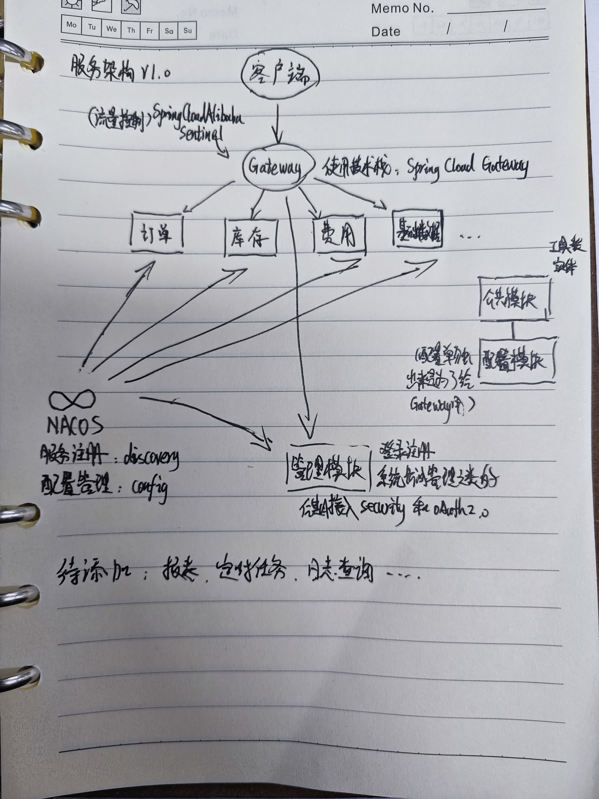

# Spring-Cloud-Alibaba-Demo

## 介绍
本项目是用来学习微服务架构的开发流程，包括：
* nacos discovery —— 服务注册与发现（√）
* nacos config —— 配置中心（√）
* spring cloud openfeign —— 服务调用（√）
* spring cloud gateway —— 网关（√）
* sentinel —— 流量控制（√）
* spring security —— 权限认证
* oauth2 —— 认证授权
* mybatis plus —— ORM框架（√）
* druid —— 数据库连接池/多数据源（√）
* maven archetype —— 微服务脚手架：[传送门](https://github.com/italycalibur2019/micro-service-demo)
* 2025-02-15新增：xxl-job —— 定时任务调度（√）：[传送门](https://github.com/italycalibur2019/xxl-job-pg/tree/master-pg)
* （后续想到要做什么再更新）
## 背景
利用微服务架构，实现一个基本的WMS系统，包含：
* admin：管理模块 —— 访问控制、用户管理、角色管理、菜单管理、权限管理等
* basic：基础模块 —— 基础数据管理，如：客户、供应商、仓库、商品等
* order：订单模块 —— 订单的采集、处理、审核、打印等
* stock：库存模块 —— 库存管理，如：出入库管理、库存盘点、库存调拨、库存统计等
* fee：费用模块 —— 费用管理，如：运费、运费模板、运费规则等（这块涉及到费用业务的盲点）
* report：报表模块 —— 报表展示，如：库存报表、订单报表、费用报表等
* task：任务模块 —— 任务管理，如：任务计划、任务执行、任务日志等
## 一些心得体会
在学习技术栈的时候，看视频固然是一个不错的选择，但是，在看视频的同时，一定要多看几遍文档，文档中提供的示例代码，是最重要的，有的视频讲解的版本是和自己实际使 
用的版本是不一样的，因此在跟着视频做的时候难免会出现各种代码报错和运行bug，这个时候就必须看文档，我的个人经验是，不要看CSDN和博客园，基本上都是废话。
## 服务架构图（渣手绘）

## 技术栈和运行环境版本
* JDK 17
* Nacos 2.5.0
* Sentinel 1.8.8
* PostgreSQL 17
* Spring Boot 3.3.8 
* Spring Cloud Alibaba 2023.0.3.2 (最新的Spring Boot 3.4.X不行，启动时直接提示不兼容，这是学习的第一个坑)
* Spring Cloud 2023.0.2 (同样只支持Spring Boot 3.3.X)
* 2025-02-15新增：xxl-job 3.0.0 (感谢许雪里大佬！这一版是第一次适配Spring Boot 3，学习了一小时左右就启动成功了！)